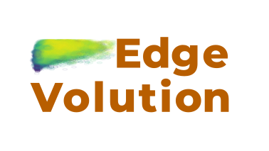
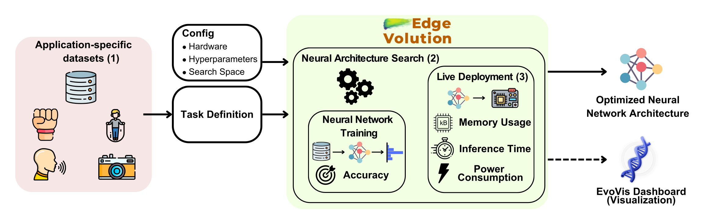

EdgeVolution is a software-hardware end-to-end pipeline that allows to optimize preprocessing and neural network architectures for microcontrollers in an end-to-end fashion. It features different building blocks that can be customized individually.




# Getting Started

Welcome to EdgeVolution! You can follow this simple guide here to get a high-level overview. You can find a more comprehensive documentation [here](https://edgevolution.readthedocs.io/).

### Cloning the repository

``` 
git clone https://github.com/ankilab/EdgeVolution
```

### Building the Docker Image

```bash
docker build -t edgevolution-container .
```

### Running the Container

```bash
docker run -it --rm --user $(id -u):$(id -g) --privileged --cpus="10.0" --gpus all -v $(pwd):/EdgeVolution edgevolution-container
```

### Defining hyperparameters
Before the EdgeVolution optimization run is started, some configurations must be made. These include the definition of hyperparameters, the search space and the boards that are to be used for evaluating the candidates on the microcontroller.

1) Search space setup
[search space setup](conf/search_space/README.md)

2) Hyperparameters
[hyperparameters](conf/hyperparameters/README.md)  --> Important to update results path!

3) Microcontroller setup
[microcontroller boards](conf/boards/README.md)


### Running an experiment

```
python main.py +hyperparameters=<your_hyperparams> +search_space=<your_search_space> +boards=nrf52840dk
```

# Community Support
Community support is provided via a [Discord Server](https://discord.gg/dAVbR923cD) for real-time community support.


# Contributing to EdgeVolution
To contribute to EdgeVolution, follow these steps:

1. Fork this repository.
2. Create a branch: `git checkout -b <branch_name>`.
3. Make your changes and commit them: `git commit -m '<commit_message>'`
4. Push to the original branch: `git push origin <project_name>/<location>`
5. Create the pull request.

Alternatively see the GitHub documentation on [creating a pull request](https://help.github.com/en/github/collaborating-with-issues-and-pull-requests/creating-a-pull-request).


# Contact

If you want to contact me you can create a github issue or reach out on Discord.

# License

This project is licensed under the Apache License 2.0 - see the [LICENSE](LICENSE) file for details.

# Citation

tbd
